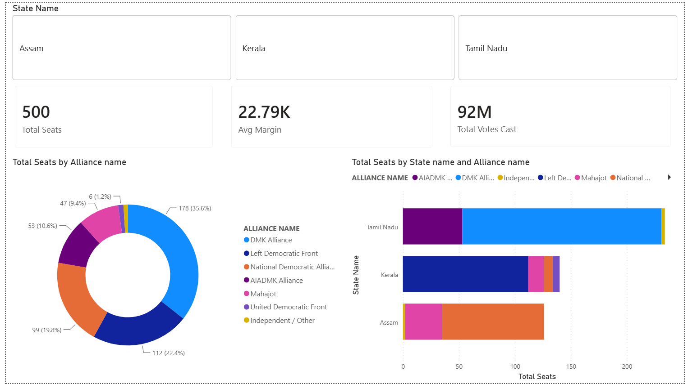
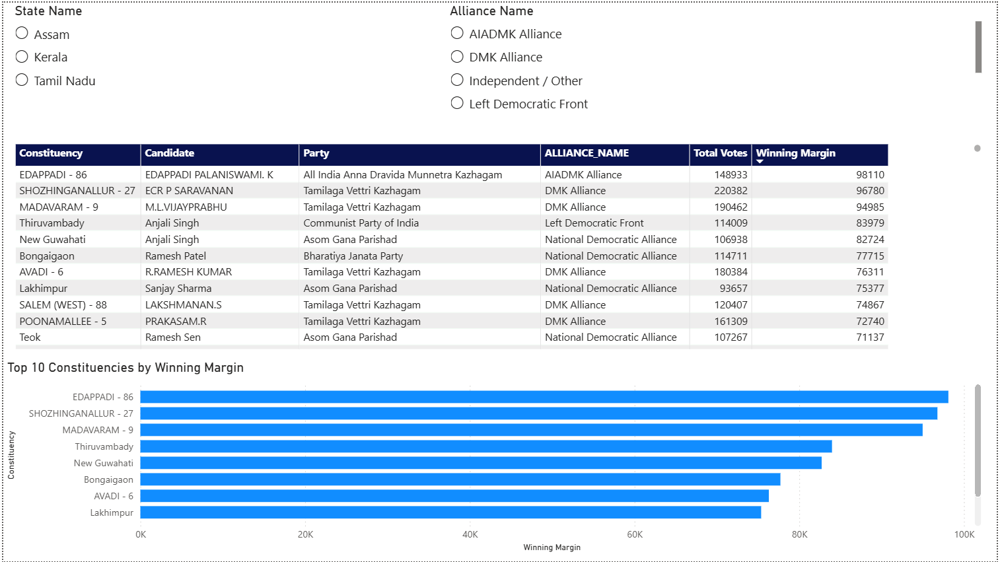
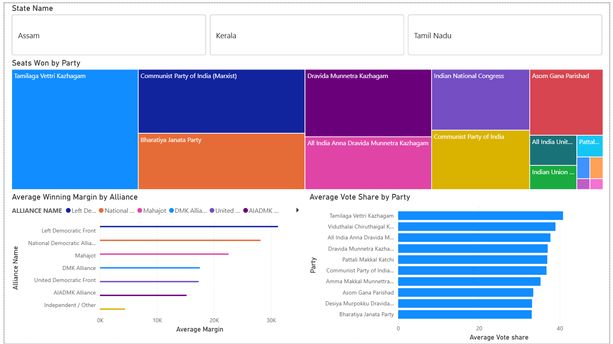

# 🗳️ Indian Assembly Election Results Dashboard

A multi-state election results analysis project covering **Tamil Nadu**, **Kerala**, and **Assam** assembly elections. Built with Python (Pandas) for data cleaning and Power BI for interactive visualization.

---

## 📊 Dashboard Preview

### Page 1 — Overview


### Page 2 — Constituency Details


### Page 3 — Party & Alliance Battle


---

## 🗂️ Project Structure

```
election-results-dashboard/
├── data/
│   ├── tamilnadu.xlsx
│   ├── Assam2026Election_Details.csv
│   ├── Assam2026Election_Constituency_Metadata.csv
│   ├── Assam2026Election_Alliance.csv
│   ├── Kerala_State_Elections_2026_Details.csv
│   ├── Kerala_State_Elections_2026_Constituency_Metadata.csv
│   ├── Kerala_State_Elections_2026_Alliance.csv
│   └── master_election_data.xlsx        ← cleaned output
├── clean_data.py                         ← data cleaning script
├── analysis.py                           ← exploratory analysis script
├── Election_Dashboard.pbix               ← Power BI dashboard
└── README.md
```

---

## 🛠️ Tools & Technologies

| Tool | Purpose |
|---|---|
| Python | Data cleaning and merging |
| Pandas | DataFrame operations |
| Power BI | Interactive dashboard |
| DAX | Custom measures |
| Excel | Data source |

---

## 🔄 Data Pipeline

### Step 1 — Load
- Tamil Nadu: Excel (.xlsx) — 4,257 rows
- Assam 2026: CSV files — 756 rows
- Kerala 2026: CSV files — 980 rows

### Step 2 — Clean & Standardize
- Renamed columns across all 3 states to a unified schema
- Derived missing columns for Tamil Nadu (Tot_Constituency_votes_polled, Winning_votes, Win_Lost_Flag)
- Fixed duplicate rows from alliance merge using `drop_duplicates(subset=["PARTY_FULL_NAME"])`

### Step 3 — Merge
- Joined Details + Constituency Metadata + Alliance files for each state
- Built manual TN alliance mapping (DMK Alliance, AIADMK Alliance)
- Combined all 3 states into one master DataFrame (5,993 rows, 23 columns)

### Step 4 — Derive
- Calculated `Rank` per constituency using `groupby + rank()`
- Derived `Runner_up_votes` and `Margin` (winner votes − runner-up votes)

---

## 📈 Key Insights

| Insight | Finding |
|---|---|
| Biggest winning margin | Edappadi Palaniswami — 98,110 votes (TN) |
| Closest contest | Tiruppattur, TN — won by just 30 votes |
| Most seats won (party) | Tamilaga Vettri Kazhagam — 107 seats |
| Highest avg vote share | TVK — 40.82% |
| Most contested seat | Karur, TN — 80 candidates |
| Strongest alliance avg margin | Left Democratic Front — 31,231 votes |
| Total votes analyzed | 92 million across 3 states |

---

## 📊 Power BI Dashboard Pages

### Page 1 — Overview
- KPI Cards: Total Seats (500), Avg Margin (22.79K), Total Votes Cast (92M)
- Donut Chart: Alliance seat share
- Stacked Bar: State-wise seats by alliance
- Slicer: Filter by state

### Page 2 — Constituency Details
- Winner table with Constituency, Candidate, Party, Alliance, Votes, Margin
- Top 10 constituencies by winning margin (bar chart)
- Slicers: State and Alliance

### Page 3 — Party & Alliance Battle
- Treemap: Seats won by party
- Bar chart: Average winning margin by alliance
- Bar chart: Top 10 parties by average vote share

---

## ⚙️ DAX Measures

```dax
Total Seats = COUNTROWS(FILTER('Sheet1', 'Sheet1'[Win_Lost_Flag] = TRUE()))

Avg Margin = AVERAGEX(FILTER('Sheet1', 'Sheet1'[Win_Lost_Flag] = TRUE()), 'Sheet1'[Margin])

Avg Vote Share = AVERAGEX(FILTER('Sheet1', 'Sheet1'[Win_Lost_Flag] = TRUE()), 'Sheet1'[%_of_Votes])

Total Votes Cast = SUM('Sheet1'[Total_Votes])
```

---

## 🚀 How to Run

1. Clone the repository
2. Place all data files in the `data/` folder
3. Run `python clean_data.py` — generates `master_election_data.xlsx`
4. Run `python analysis.py` — prints key insights to terminal
5. Open `Election_Dashboard.pbix` in Power BI Desktop

---

## 👤 Author

**Muhammed Murshid M**
Data Analytics Intern — Techolas Technologies
[LinkedIn] (www.linkedin.com/in/muhammed-murshidm)
